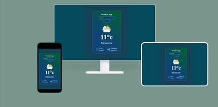

# 🌤️ Weather App


> Небольшое веб-приложение, которое позволяет узнать актуальную погоду в любом городе.  
> При вводе названия города отображаются **температура**, **влажность** и **скорость ветра**.

---

## 📋 О проекте

**Weather App** — это учебный проект в формате **лендинга**, созданный для практики работы с **HTML**, **CSS** и **JavaScript**.  
Основная задача проекта — реализовать простое и понятное приложение, которое обращается к **API погоды** и отображает полученные данные пользователю.

---

## 🖼️ Превью проекта

> **  
> [🔗 Открыть сайт на GitHub Pages](https://username.github.io/positivus)

---

## 🧠 Основные возможности

- 🔍 Поиск погоды по названию города  
- 🌡️ Отображение актуальной температуры  
- 💧 Показатель влажности  
- 🌬️ Скорость ветра  
- ⚡ Работа с внешним API (без серверной части)  
- 💻 Адаптивная вёрстка  

---

## 🛠️ Технологии

Проект реализован на **чистом JavaScript** без использования фреймворков.

| Технология | Назначение |
|-------------|------------|
| **HTML5** | Разметка и структура страницы |
| **CSS3** | Стилизация интерфейса |
| **JavaScript (ES6+)** | Логика приложения и работа с API |
| **Weather API** | Получение данных о погоде |
| **GitHub Pages** | Хостинг и деплой проекта |

---

## ⚙️ Установка и запуск

Проект не требует установки зависимостей.

### 🔧 Вариант 1 — через интерфейс
Открой файл `index.html` в браузере.  
Это запустит проект локально.

### 🌍 Вариант 2 — через GitHub Pages
Проект задеплоен и доступен по ссылке (пример):
```
https://aleksandevelop.github.io/WeatherApp-on-js/
```

---

## 📂 Структура проекта

Примерная структура проекта:
```
weather-app/
│
├── /images             # картинки
├── index.html          # Главная страница       
│
├── README.md           # Документация проекта
|
├── scripts.js          # Основная логика и работа с API
│
├── styles.css          # стили проекта
└──
```

---

## 🧩 Используемый API

Приложение получает данные о погоде из публичного API


---

## 🚀 Деплой

Проект размещён на **GitHub Pages**.  
Деплой осуществляется автоматически через репозиторий GitHub:
1. Добавь все файлы в репозиторий  
2. В настройках выбери ветку `main` → `Deploy from branch`  
3. Ссылка появится в разделе **Pages**

---

## 🧑‍💻 Автор

**Автор:** Aleksander  
📫 Контакты: *https://t.me/saneckaz*

---

## 📜 Лицензия

Проект создан в образовательных целях.  
Все права на используемые данные и API принадлежат их владельцам.
